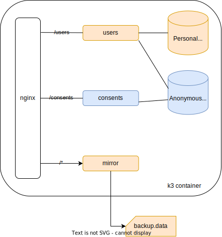

# dgk - backend engineering challenge

**Prerequisites**

```
Ubuntu 20+ LTS
k3s version v1.23+
Node v16+
```

**At a glance**


**Quick start**

```
#k3s install as root
curl -sfL https://get.k3s.io | sh -s - \
--disable traefik \
--disable metrics-server \
--disable local-storage \
--disable-cloud-controller \
--disable metrics-server \
--write-kubeconfig-mode 644

# copy and edit .env to match your preferences
cp dotenv_sample .env

npm install
npm run setup
npm run build

# start local cluster
sh dist/dgk-ort-dev-postgres/sbin/start.sh
```

Check microservices state

```
sh dist/dgk-ort-dev-postgres/sbin/watch.sh
```

```
NAME READY STATUS RESTARTS AGE
pod/postgrespi-deploy-0 1/1 Running 0 32m
pod/nginx-deploy-7b6b88dbc4-tclgd 1/1 Running 0 32m
pod/users-deploy-7c5bcdf649-kzxpv 1/1 Running 0 32m
pod/postgresad-deploy-0 1/1 Running 0 32m
...

```

**Running tests**

```
npm test
```

expected output

```
> dgk-backend-challenge@1.0.0 test
> node build.mjs && node test.mjs

users CRUD
        users_POST__valid
        users_POST__email_duplicate
        users_POST__missing_id
        users_POST__bad_email
        users_POST__empty
        users_GET
        users_DELETE
```

**Replay request**

Api requests are stored into temporary file dist/<deploy>/data/**requests.backup**

```
# replay file located at data/requests.backup
npm run replay
```

**helpers scripts to manage local cluster**

```
dist/dgk-ort-dev-postgres/sbin/
├── debug.sh  <microservice_id>
├── events.sh
├── logs.sh   <microservice_id>
├── reset.sh
├── restart.sh
├── start.sh
├── stop.sh
└── watch.sh
```
